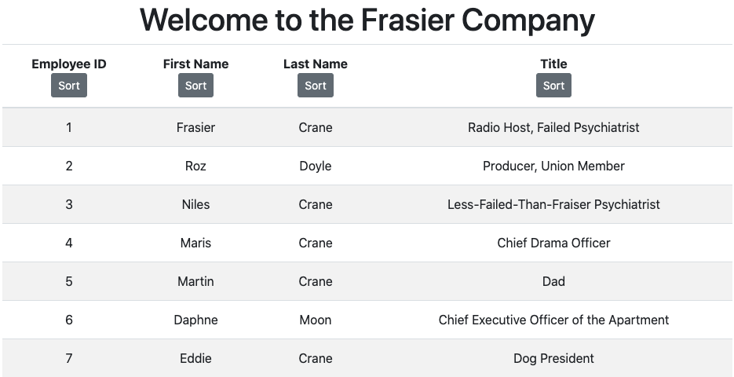

# employeelist4u

### Created on 10/1/2020

### By longhike

## Description:

A front-end React app that displays a list of employees of the Frasier Company, where each column can be sorted alphabetically. 

UPDATES TO COME:
1. add randomized functionality (create a list of different companies and display each randomly on load)

## Set-up & Installation requirements:

run `npm start`

## Known Bugs:

No known bugs.

## Support & Contact details:

e-mail long.hike.dev@gmail.com

## Technologies Used

HTML

CSS / Boostrap

Javascript / React.js

Node.js

## Contribution Guidlines 
​
Direct link to site:
TK
​
### License
​
Copyright(c) 2020 By longhike
​
This software is licensed under MIT license.
